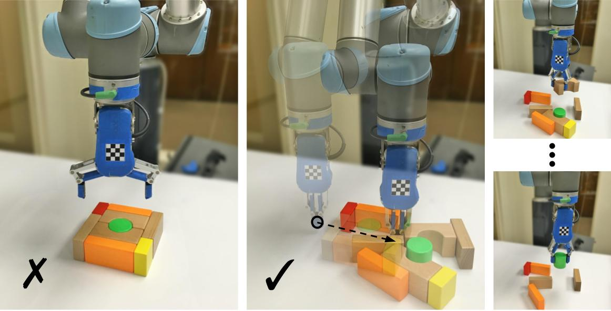
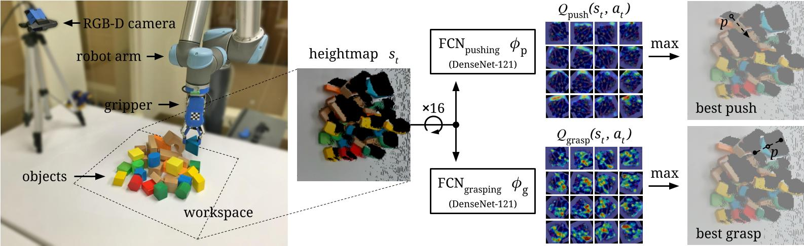
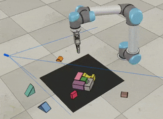
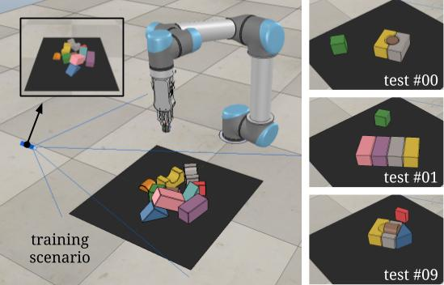
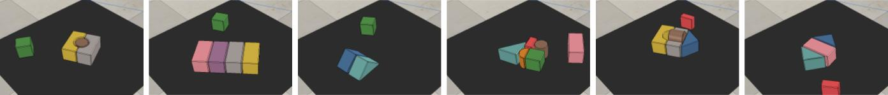
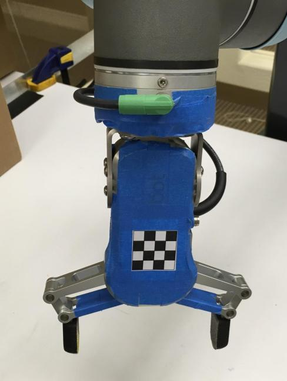

# Visual Pushing and Grasping Toolbox

Visual Pushing and Grasping (VPG) is a method for training robotic agents to learn how to plan complementary pushing and grasping actions for manipulation (*e.g.* for unstructured pick-and-place applications). VPG operates directly on visual observations (RGB-D images), learns from trial and error, trains quickly, and generalizes to new objects and scenarios.




&nbsp;&nbsp;&nbsp;&nbsp;&nbsp;&nbsp;&nbsp;&nbsp;&nbsp;&nbsp;<br>

This repository provides PyTorch code for training and testing VPG policies with deep reinforcement learning in both simulation and real-world settings on a UR5 robot arm. This is the reference implementation for the paper:

### Learning Synergies between Pushing and Grasping with Self-supervised Deep Reinforcement Learning

[PDF](https://arxiv.org/pdf/1803.09956.pdf) | [Webpage & Video Results](http://vpg.cs.princeton.edu/)

[Andy Zeng](http://andyzeng.github.io/), [Shuran Song](http://vision.princeton.edu/people/shurans/), [Stefan Welker](https://www.linkedin.com/in/stefan-welker), [Johnny Lee](http://johnnylee.net/), [Alberto Rodriguez](http://meche.mit.edu/people/faculty/ALBERTOR@MIT.EDU), [Thomas Funkhouser](https://www.cs.princeton.edu/~funk/)

IEEE/RSJ International Conference on Intelligent Robots and Systems (IROS) 2018

Skilled robotic manipulation benefits from complex synergies between non-prehensile (*e.g.* pushing) and prehensile (*e.g.* grasping) actions: pushing can help rearrange cluttered objects to make space for arms and fingers; likewise, grasping can help displace objects to make pushing movements more precise and collision-free. In this work, we demonstrate that it is possible to discover and learn these synergies from scratch through model-free deep reinforcement learning. Our method involves training two fully convolutional networks that map from visual observations to actions: one infers the utility of pushes for a dense pixel-wise sampling of end effector orientations and locations, while the other does the same for grasping. Both networks are trained jointly in a Q-learning framework and are entirely self-supervised by trial and error, where rewards are provided from successful grasps. In this way, our policy learns pushing motions that enable future grasps, while learning grasps that can leverage past pushes. During picking experiments in both simulation and real-world scenarios, we find that our system quickly learns complex behaviors amid challenging cases of clutter, and achieves better grasping success rates and picking efficiencies than baseline alternatives after only a few hours of training. We further demonstrate that our method is capable of generalizing to novel objects.

<!--  -->


#### Citing

If you find this code useful in your work, please consider citing:

```
@inproceedings{zeng2018learning,
  title={Learning Synergies between Pushing and Grasping with Self-supervised Deep Reinforcement Learning},
  author={Zeng, Andy and Song, Shuran and Welker, Stefan and Lee, Johnny and Rodriguez, Alberto and Funkhouser, Thomas},
  booktitle={IEEE/RSJ International Conference on Intelligent Robots and Systems (IROS)},
  year={2018}
}
```

#### Demo Videos
Demo videos of a real robot in action can be found [here](http://vpg.cs.princeton.edu/).

#### Contact
If you have any questions or find any bugs, please let me know: [Andy Zeng](http://www.cs.princeton.edu/~andyz/) andyz[at]princeton[dot]edu

## Installation

This implementation requires the following dependencies (tested on Ubuntu 16.04.4 LTS): 

* Python 2.7 or Python 3 
* [NumPy](http://www.numpy.org/), [SciPy](https://www.scipy.org/scipylib/index.html), [OpenCV-Python](https://docs.opencv.org/3.0-beta/doc/py_tutorials/py_tutorials.html), [Matplotlib](https://matplotlib.org/). You can quickly install/update these dependencies by running the following (replace `pip` with `pip3` for Python 3):
  ```shell
  pip install numpy scipy opencv-python matplotlib
  ```
* ~~[PyTorch](http://pytorch.org/) version 0.3. Since 0.3 is no longer the latest version, see installation instructions [here](http://pytorch.org/previous-versions/) or run the following:~~
  ~~```
  pip install torch==0.3.1 torchvision==0.2.0
  ```~~
* [PyTorch](http://pytorch.org/) version 1.0+ (thanks [Andrew](https://github.com/ahundt) for the support!):
  ```shell
  pip install torch torchvision
  ```
  <!-- Support for PyTorch version 0.4+ is work-in-progress and lives in [this branch](https://github.com/andyzeng/visual-pushing-grasping/tree/support-pytorch-v0.4), but currently remains unstable. -->

* [V-REP](http://www.coppeliarobotics.com/) (now known as [CoppeliaSim](http://www.coppeliarobotics.com/)) simulation environment

### (Optional) GPU Acceleration
Accelerating training/inference with an NVIDIA GPU requires installing [CUDA](https://developer.nvidia.com/cuda-downloads) and [cuDNN](https://developer.nvidia.com/cudnn). You may need to register with NVIDIA for the CUDA Developer Program (it's free) before downloading. This code has been tested with CUDA 8.0 and cuDNN 6.0 on a single NVIDIA Titan X (12GB). Running out-of-the-box with our pre-trained models using GPU acceleration requires 8GB of GPU memory. Running with GPU acceleration is **highly recommended**, otherwise each training iteration will take several minutes to run (as opposed to several seconds). This code automatically detects the GPU(s) on your system and tries to use it. If you have a GPU, but would instead like to run in CPU mode, add the tag `--cpu` when running `main.py` below.

## A Quick-Start: Demo in Simulation




This demo runs our pre-trained model with a UR5 robot arm in simulation on challenging picking scenarios with adversarial clutter, where grasping an object is generally not feasible without first pushing to break up tight clusters of objects. 

### Instructions

1. Checkout this repository and download our pre-trained models.

    ```shell
    git clone https://github.com/andyzeng/visual-pushing-grasping.git visual-pushing-grasping
    cd visual-pushing-grasping/downloads
    ./download-weights.sh
    cd ..
    ```

1. Run V-REP (navigate to your V-REP/CoppeliaSim directory and run `./vrep.sh` or `./coppeliaSim.sh`). From the main menu, select `File` > `Open scene...`, and open the file `visual-pushing-grasping/simulation/simulation.ttt` from this repository.

1. In another terminal window, run the following (simulation will start in the V-REP window). **Please note:** our pre-trained models were trained with PyTorch version 0.3, so this will only run with PyTorch 0.3. Training from scratch (next section) should still work with PyTorch 1.0+.

    ```shell
    python main.py --is_sim --obj_mesh_dir 'objects/blocks' --num_obj 10 \
        --push_rewards --experience_replay --explore_rate_decay \
        --is_testing --test_preset_cases --test_preset_file 'simulation/test-cases/test-10-obj-07.txt' \
        --load_snapshot --snapshot_file 'downloads/vpg-original-sim-pretrained-10-obj.pth' \
        --save_visualizations
    ```

Note: you may get a popup window titled "Dynamics content" in your V-REP window. Select the checkbox and press OK. You will have to do this a total of 3 times before it stops annoying you.

## Training

To train a regular VPG policy from scratch in simulation, first start the simulation environment by running V-REP (navigate to your V-REP directory and run `./vrep.sh`). From the main menu, select `File` > `Open scene...`, and open the file `visual-pushing-grasping/simulation/simulation.ttt`. Then navigate to this repository in another terminal window and run the following:

```shell
python main.py --is_sim --push_rewards --experience_replay --explore_rate_decay --save_visualizations
```

Data collected from each training session (including RGB-D images, camera parameters, heightmaps, actions, rewards, model snapshots, visualizations, etc.) is saved into a directory in the `logs` folder. A training session can be resumed by adding the flags `--load_snapshot` and `--continue_logging`, which then loads the latest model snapshot specified by `--snapshot_file` and transition history from the session directory specified by `--logging_directory`:

```shell
python main.py --is_sim --push_rewards --experience_replay --explore_rate_decay --save_visualizations \
    --load_snapshot --snapshot_file 'logs/YOUR-SESSION-DIRECTORY-NAME-HERE/models/snapshot-backup.reinforcement.pth' \
    --continue_logging --logging_directory 'logs/YOUR-SESSION-DIRECTORY-NAME-HERE' \
```

Various training options can be modified or toggled on/off with different flags (run `python main.py -h` to see all options):

```shell
usage: main.py [-h] [--is_sim] [--obj_mesh_dir OBJ_MESH_DIR]
               [--num_obj NUM_OBJ] [--tcp_host_ip TCP_HOST_IP]
               [--tcp_port TCP_PORT] [--rtc_host_ip RTC_HOST_IP]
               [--rtc_port RTC_PORT]
               [--heightmap_resolution HEIGHTMAP_RESOLUTION]
               [--random_seed RANDOM_SEED] [--method METHOD] [--push_rewards]
               [--future_reward_discount FUTURE_REWARD_DISCOUNT]
               [--experience_replay] [--heuristic_bootstrap]
               [--explore_rate_decay] [--grasp_only] [--is_testing]
               [--max_test_trials MAX_TEST_TRIALS] [--test_preset_cases]
               [--test_preset_file TEST_PRESET_FILE] [--load_snapshot]
               [--snapshot_file SNAPSHOT_FILE] [--continue_logging]
               [--logging_directory LOGGING_DIRECTORY] [--save_visualizations]
```

Results from our baseline comparisons and ablation studies in our [paper](https://arxiv.org/pdf/1803.09956.pdf) can be reproduced using these flags. For example:

* Train reactive policies with pushing and grasping (P+G Reactive); specify `--method` to be `'reactive'`, remove `--push_rewards`, remove `--explore_rate_decay`:

    ```shell
    python main.py --is_sim --method 'reactive' --experience_replay --save_visualizations
    ```

* Train reactive policies with grasping-only (Grasping-only); similar arguments as P+G Reactive above, but add `--grasp_only`:

    ```shell
    python main.py --is_sim --method 'reactive' --experience_replay --grasp_only --save_visualizations
    ```

* Train VPG policies without any rewards for pushing (VPG-noreward); similar arguments as regular VPG, but remove `--push_rewards`:

    ```shell
    python main.py --is_sim --experience_replay --explore_rate_decay --save_visualizations
    ```

* Train shortsighted VPG policies with lower discount factors on future rewards (VPG-myopic); similar arguments as regular VPG, but set `--future_reward_discount` to `0.2`:

    ```shell
    python main.py --is_sim --push_rewards --future_reward_discount 0.2 --experience_replay --explore_rate_decay --save_visualizations
    ```

To plot the performance of a session over training time, run the following:

```shell
python plot.py 'logs/YOUR-SESSION-DIRECTORY-NAME-HERE'
```

Solid lines indicate % grasp success rates (primary metric of performance) and dotted lines indicate % push-then-grasp success rates (secondary metric to measure quality of pushes) over training steps. By default, each point in the plot measures the average performance over the last 200 training steps. The range of the x-axis is from 0 to 2500 training steps. You can easily change these parameters at the top of `plot.py`.

To compare performance between different sessions, you can draw multiple plots at a time:

```shell
python plot.py 'logs/YOUR-SESSION-DIRECTORY-NAME-HERE' 'logs/ANOTHER-SESSION-DIRECTORY-NAME-HERE'
```

## Evaluation

We provide a collection 11 test cases in simulation with adversarial clutter. Each test case consists of a configuration of 3 - 6 objects placed in the workspace in front of the robot. These configurations are manually engineered to reflect challenging picking scenarios, and remain exclusive from the training procedure. Across many of these test cases, objects are laid closely side by side, in positions and orientations that even an optimal grasping policy would have trouble successfully picking up any of the objects without de-cluttering first. As a sanity check, a single isolated object is additionally placed in the workspace separate from the configuration. This is just to ensure that all policies have been sufficiently trained prior to the benchmark (*i.e.* a policy is not ready if fails to grasp the isolated object).



The [demo](#a-quick-start-demo-in-simulation) above runs our pre-trained model multiple times (x30) on a single test case. To test your own pre-trained model, simply change the location of `--snapshot_file`:

```shell
python main.py --is_sim --obj_mesh_dir 'objects/blocks' --num_obj 10 \
    --push_rewards --experience_replay --explore_rate_decay \
    --is_testing --test_preset_cases --test_preset_file 'simulation/test-cases/test-10-obj-07.txt' \
    --load_snapshot --snapshot_file 'YOUR-SNAPSHOT-FILE-HERE' \
    --save_visualizations
```

Data from each test case will be saved into a session directory in the `logs` folder. To report the average testing performance over a session, run the following:

```shell
python evaluate.py --session_directory 'logs/YOUR-SESSION-DIRECTORY-NAME-HERE' --method SPECIFY-METHOD --num_obj_complete N
```

where `SPECIFY-METHOD` can be `reactive` or `reinforcement`, depending on the architecture of your model.

`--num_obj_complete N` defines the number of objects that need to be picked in order to consider the task completed. For example, when evaluating our pre-trained model in the demo test case, `N` should be set to 6: 

```shell
python evaluate.py --session_directory 'logs/YOUR-SESSION-DIRECTORY-NAME-HERE' --method 'reinforcement' --num_obj_complete 6
```

Average performance is measured with three metrics (for all metrics, higher is better):
1. Average % completion rate over all test runs: measures the ability of the policy to finish the task by picking up at least `N` objects without failing consecutively for more than 10 attempts.
1. Average % grasp success rate per completion.
1. Average % action efficiency: describes how succinctly the policy is capable of finishing the task. See our [paper](https://arxiv.org/pdf/1803.09956.pdf) for more details on how this is computed.

### Creating Your Own Test Cases in Simulation

To design your own challenging test case:

1. Open the simulation environment in V-REP (navigate to your V-REP directory and run `./vrep.sh`). From the main menu, select `File` > `Open scene...`, and open the file `visual-pushing-grasping/simulation/simulation.ttt`.
1. In another terminal window, navigate to this repository and run the following:

    ```shell
    python create.py
    ```

1. In the V-REP window, use the V-REP toolbar (object shift/rotate) to move around objects to desired positions and orientations.
1. In the terminal window type in the name of the text file for which to save the test case, then press enter.
1. Try it out: run a trained model on the test case by running `main.py` just as in the demo, but with the flag `--test_preset_file` pointing to the location of your test case text file.

## Running on a Real Robot (UR5)

The same code in this repository can be used to train on a real UR5 robot arm (tested with UR Software version 1.8). To communicate with later versions of UR software, several minor changes may be necessary in `robot.py` (*e.g.* functions like `parse_tcp_state_data`). Tested with Python 2.7 (not fully tested with Python 3).

### Setting Up Camera System

The latest version of our system uses RGB-D data captured from an [Intel® RealSense™ D415 Camera](https://click.intel.com/intelr-realsensetm-depth-camera-d415.html). We provide a lightweight C++ executable that streams data in real-time using [librealsense SDK 2.0](https://github.com/IntelRealSense/librealsense) via TCP. This enables you to connect the camera to an external computer and fetch RGB-D data remotely over the network while training. This can come in handy for many real robot setups. Of course, doing so is not required -- the entire system can also be run on the same computer.

#### Installation Instructions:

1. Download and install [librealsense SDK 2.0](https://github.com/IntelRealSense/librealsense)
1. Navigate to `visual-pushing-grasping/realsense` and compile `realsense.cpp`:

    ```shell
    cd visual-pushing-grasping/realsense
    cmake .
    make
    ```

1. Connect your RealSense camera with a USB 3.0 compliant cable (important: RealSense D400 series uses a USB-C cable, but still requires them to be 3.0 compliant to be able to stream RGB-D data).
1. To start the TCP server and RGB-D streaming, run the following:

    ```shell
    ./realsense
    ```

Keep the executable running while calibrating or training with the real robot (instructions below). To test a python TCP client that fetches RGB-D data from the active TCP server, run the following:

```shell
cd visual-pushing-grasping/real
python capture.py
```

### Calibrating Camera Extrinsics




We provide a simple calibration script to estimate camera extrinsics with respect to robot base coordinates. To do so, the script moves the robot gripper over a set of predefined 3D locations as the camera detects the center of a moving 4x4 checkerboard pattern taped onto the gripper. The checkerboard can be of any size (the larger, the better).

#### Instructions:

1. Predefined 3D locations are sampled from a 3D grid of points in the robot's workspace. To modify these locations, change the variables `workspace_limits` and `calib_grid_step` at the top of `calibrate.py`.

1. Measure the offset between the midpoint of the checkerboard pattern to the tool center point in robot coordinates (variable `checkerboard_offset_from_tool`). This offset can change depending on the orientation of the tool (variable `tool_orientation`) as it moves across the predefined locations. Change both of these variables respectively at the top of `calibrate.py`. 

1. The code directly communicates with the robot via TCP. At the top of `calibrate.py`, change variable `tcp_host_ip` to point to the network IP address of your UR5 robot controller.

1. With caution, run the following to move the robot and calibrate:

    ```shell
    python calibrate.py
    ```

The script also optimizes for a z-scale factor and saves it into `real/camera_depth_scale.txt`. This scale factor should be multiplied with each depth pixel captured from the camera. This step is more relevant for the RealSense SR300 cameras, which commonly suffer from a severe scaling problem where the 3D data is often 15-20% smaller than real world coordinates. The D400 series are less likely to have such a severe scaling problem. 

### Training

To train on the real robot, simply run:

```shell
python main.py --tcp_host_ip 'XXX.XXX.X.XXX' --tcp_port 30002 --push_rewards --experience_replay --explore_rate_decay --save_visualizations
```

where `XXX.XXX.X.XXX` is the network IP address of your UR5 robot controller.

### Additional Tools

* Use `touch.py` to test calibrated camera extrinsics -- provides a UI where the user can click a point on the RGB-D image, and the robot moves its end-effector to the 3D location of that point
* Use `debug.py` to test robot communication and primitive actions
